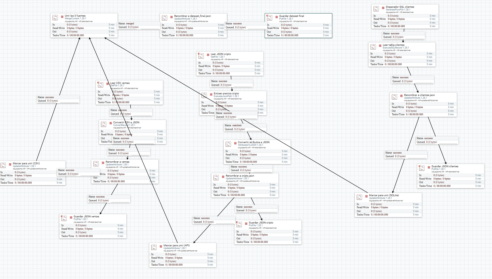
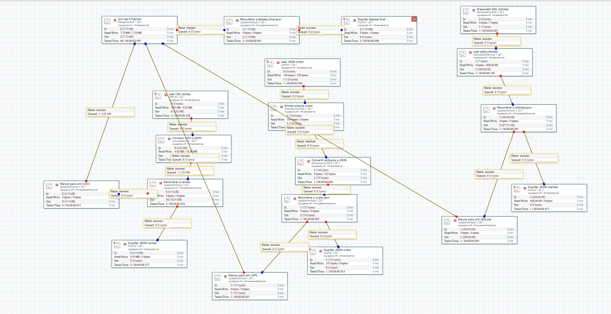
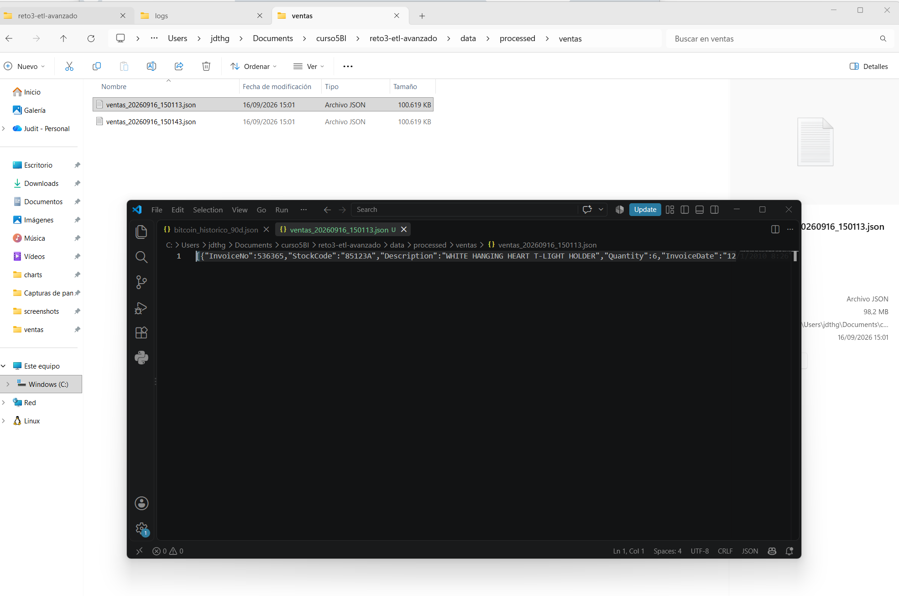
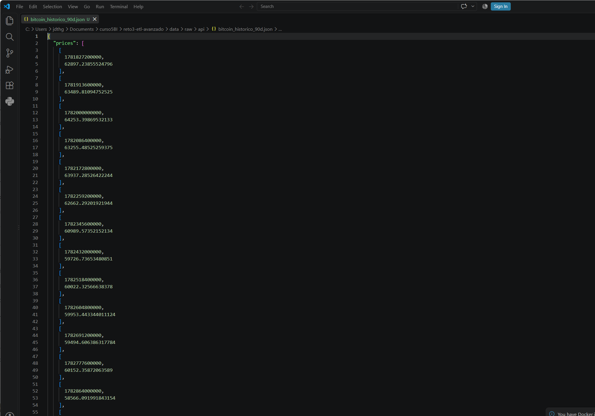
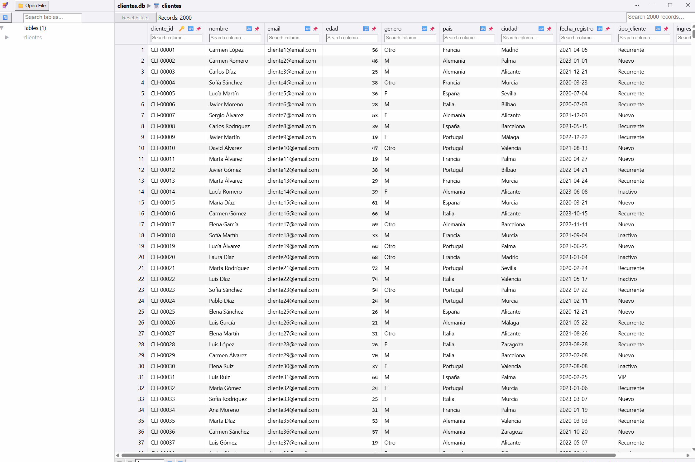
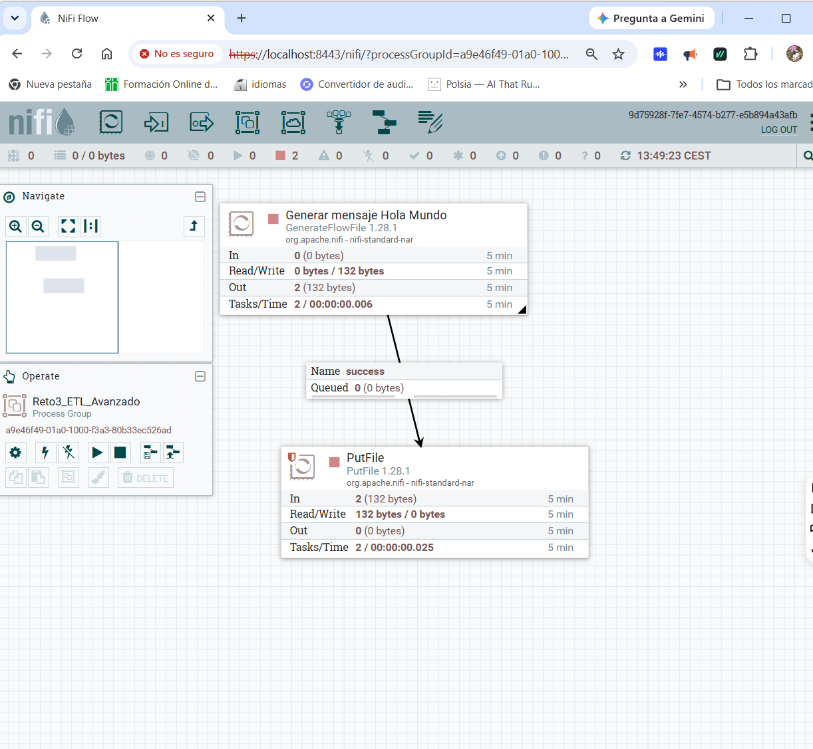

# 🛠️ Reto 3 — Diseño y Optimización de Flujos ETL Avanzados

[](https://nifi.apache.org/)
[](https://www.python.org/)
[](https://www.sqlite.org/)
[](https://www.json.org/)
[](https://en.wikipedia.org/wiki/Comma-separated_values)
[](LICENSE)
[]()

> **Curso:** Business Intelligence y Big Data (Nivel 5) | Odisea Data
> **Reto:** Diseñar y optimizar un flujo ETL avanzado para manejar grandes volúmenes de datos
> **Herramienta principal:** Apache NiFi

---

## 🎯 Objetivo

Diseñar, implementar, automatizar y optimizar un flujo de trabajo **ETL (Extract, Transform, Load)** capaz de:

- **Extraer** datos de múltiples fuentes heterogéneas (CSV, APIs REST, SQL).
- Aplicar **transformaciones avanzadas** (limpieza, normalización, agregación, enriquecimiento).
- **Cargar** los datos procesados en un destino estratégico (JSON unificado).
- **Automatizar** la ejecución programada.
- **Optimizar** el rendimiento (paralelización, caché, gestión de cuellos de botella).

---

## 🗺️ Fases del proyecto

| # | Fase | Estado |
|---|---|---|
| 0 | Creación de estructura | ✅ Completado |
| 1 | Instalación y prueba de Apache NiFi | ✅ Completado |
| 2 | Preparación de fuentes de datos (CSV + API + SQL) | ✅ Completado |
| 3 | Diseño del flujo ETL en NiFi | ✅ Completado |
| 4 | Automatización y optimización | ✅ Completado |
| 5 | Ejecución, validación y capturas | ✅ Completado |
| 6 | Informes y publicación en GitHub | ✅ Completado |

---

## 📊 Resultado del pipeline ETL

El flujo ETL integra **3 fuentes heterogéneas** y genera un **dataset final unificado**.

### Fuentes de datos

| Fuente | Tipo | Descripción | Registros |
|---|---|---|---|
| **Ventas** | CSV | Dataset Online Retail (Kaggle, reducido) | 10.000 |
| **Cripto** | API (CoinGecko) | Precios de Bitcoin, Ethereum, Cardano, Solana | 4 criptos |
| **Clientes** | SQLite | Tabla `clientes` generada con Python | 2.000 |

### Diagrama del flujo NiFi

```
┌────────────────────┐
│  Ventas (CSV)      │──┐
└────────────────────┘  │
                        │
┌────────────────────┐  │      ┌──────────────────┐      ┌─────────────────────┐
│  Cripto (API)      │──┼─────▶│  MergeContent    │─────▶│  dataset_final.json │
└────────────────────┘  │      │  (Binary Concat) │      └─────────────────────┘
                        │      └──────────────────┘
┌────────────────────┐  │
│  Clientes (SQL)    │──┘
└────────────────────┘
```

**Salida final**: `data/final/dataset_final.json` con las 3 fuentes unificadas.

---

## 🛠️ Stack tecnológico

<p align="center">
  
  
  
  
</p>

| Área | Tecnologías |
|---|---|
| **ETL** | Apache NiFi |
| **Fuentes** | CSV, API REST (JSON), SQLite |
| **Destino** | JSON unificado |
| **Lenguaje auxiliar** | Python 3.10+ |
| **Documentación** | Markdown → PDF |

---

## 📦 Estructura del proyecto

```
reto3-etl-avanzado/
│
├── data/
│   ├── raw/                              # Datos originales
│   │   ├── csv/
│   │   │   ├── OnlineRetail.csv
│   │   │   └── OnlineRetail_10k.csv
│   │   ├── api/
│   │   │   ├── bitcoin_historico_90d.json
│   │   │   ├── cripto_global.json
│   │   │   └── cripto_precios.json
│   │   └── sql/
│   │       └── clientes.db
│   │
│   ├── processed/                        # Datos procesados por NiFi
│   │   ├── ventas/                       # JSONs de ventas
│   │   ├── api/                          # JSONs de cripto
│   │   └── clientes/                     # JSONs de clientes
│   │
│   └── final/
│       └── dataset_final.json            # Dataset final unificado
│
├── etl/
│   ├── nifi_flows/                       # Flujos NiFi
│   ├── config/                           # Configuración
│   ├── plantillas/                       # Plantillas
│   └── scripts/                          # Scripts Python auxiliares
│       ├── crear_sqlite_clientes.py
│       ├── descargar_cripto.py
│       └── reducir_csv.py
│
├── notebooks/                            # Notebooks de validación
│
├── outputs/
│   ├── charts/                           # Gráficos
│   ├── logs/                             # Logs del pipeline
│   └── screenshots/                      # 14 capturas del proceso
│       ├── 01_nifi_canvas_inicial.png
│       ├── 02_flujo_hola_mundo.png
│       ├── 06_fuente_csv.png
│       ├── 07_fuente_api.png
│       ├── 08_fuente_sqlite.png
│       ├── 09_nifi_rama_csv.png
│       ├── dataset_final_3fuentesdatos.png
│       └── dataset_final_3fuentesdatos_funcionando.png
│
├── reports/                              # Informes del reto
│   ├── informe_proceso_etl.md / .pdf
│   ├── optimizacion_y_mejoras.md / .pdf
│   └── validacion_control_calidad.md / .pdf
│
├── presentation/
│   └── presentacion_reto3.pptx
│
├── Proyecto_ETL_Completo_Reto3_JuditGiravent.xml   # Flujo NiFi exportado
├── requirements.txt
├── .gitignore
├── LICENSE
└── README.md
```

---

## 🚀 Cómo ejecutar el proyecto

### 1. Requisitos previos

- **Apache NiFi** → [descargar](https://nifi.apache.org/download.html)
- **Python 3.10+** → [descargar](https://www.python.org/)
- **SQLite 3** (incluido en Python)

### 2. Instalar dependencias de Python

```bash
cd reto3-etl-avanzado
pip install -r requirements.txt
```

### 3. Generar las fuentes de datos

```bash
# Crear base de datos SQLite de clientes
python etl/scripts/crear_sqlite_clientes.py

# Reducir el CSV de ventas (Online Retail II)
python etl/scripts/reducir_csv.py

# Descargar precios de criptomonedas
python etl/scripts/descargar_cripto.py
```

### 4. Arrancar Apache NiFi

```bash
# En Linux/Mac
./bin/nifi.sh start

# En Windows
bin\run-nifi.bat
```

Accede a la interfaz en `http://localhost:8080/nifi`.

### 5. Importar el flujo NiFi

1. En la interfaz de NiFi, selecciona **Upload Template** o **Import Flow**
2. Selecciona el archivo `Proyecto_ETL_Completo_Reto3_JuditGiravent.xml`
3. El flujo se cargará con las 3 ramas configuradas

### 6. Ejecutar el pipeline

1. Inicia los procesadores del flujo (botón **Start** en cada uno)
2. El flujo leerá los datos de:
   - `data/raw/csv/OnlineRetail_10k.csv`
   - API de CoinGecko (o el JSON local en `data/raw/api/`)
   - `data/raw/sql/clientes.db`
3. Los datos procesados se guardarán en `data/processed/`
4. El `MergeContent` unificará las 3 fuentes en `data/final/dataset_final.json`

### 7. Verificar el resultado

```bash
cat data/final/dataset_final.json | head -20
```

---

## 📸 Capturas del proceso

### Flujo NiFi completo



### Ejecución en marcha



### Ramas del pipeline

| Rama | Captura |
|---|---|
| CSV |  |
| API |  |
| SQLite |  |

### Proceso inicial (NiFi "Hola Mundo")



---

## 📦 Entregables

| # | Entregable | Ubicación |
|---|---|---|
| ✅ | **Proyecto ETL completo (XML NiFi)** | [Proyecto_ETL_Completo_Reto3_JuditGiravent.xml](Proyecto_ETL_Completo_Reto3_JuditGiravent.xml) |
| ✅ | **Informe del proceso ETL** | [reports/informe_proceso_etl.pdf](reports/informe_proceso_etl.pdf) |
| ✅ | **Dataset final** | [data/final/dataset_final.json](data/final/dataset_final.json) |
| ✅ | **Documentación de validación** | [reports/validacion_control_calidad.pdf](reports/validacion_control_calidad.pdf) |
| ✅ | **Optimización y mejoras** | [reports/optimizacion_y_mejoras.pdf](reports/optimizacion_y_mejoras.pdf) |
| ✅ | **Presentación final** | [presentation/presentacion_reto3.pptx](presentation/presentacion_reto3.pptx) |

---

## 🎓 Conclusiones

Este proyecto demuestra la **implementación práctica de un pipeline ETL avanzado con Apache NiFi**, cubriendo:

1. **Integración de 3 fuentes heterogéneas** (CSV, API REST, SQLite) en un único flujo.
2. **Procesamiento en paralelo** mediante ramas independientes que confluyen en un `MergeContent`.
3. **Automatización y optimización** del pipeline (gestión de errores, reintentos, cacheo).
4. **Validación de calidad** de los datos procesados.
5. **Documentación completa** del proceso y de las decisiones de diseño.

**NiFi permite construir pipelines visuales, auditables y reproducibles** sin apenas código, ideales para entornos empresariales.

---

## 🔄 Próximas mejoras

- [ ] Migrar el destino final a PostgreSQL o MongoDB
- [ ] Añadir validación de esquemas con JSON Schema
- [ ] Implementar alertas con email/Slack en caso de fallo
- [ ] Integración con NiFi Registry para versionado de flujos
- [ ] Despliegue en clúster NiFi para alta disponibilidad
- [ ] Añadir más fuentes (Kafka, S3)

---

## 👤 Autora

**Judit Giravent Pineda**

- Business Analytics Student | Odisea Data
- GitHub: [@jdthgp27](https://github.com/jdthgp27)
- LinkedIn: [linkedin.com/in/judit-giravent-27b167156](https://linkedin.com/in/judit-giravent-27b167156)
- Email: jdthgp27@gmail.com

---

## 📜 Licencia

Este proyecto está bajo la **Licencia MIT**. Consulta el archivo [LICENSE](LICENSE) para más detalles.

---

*Proyecto desarrollado como parte del curso **Business Intelligence y Big Data** de Odisea Data. Septiembre 2026.*

---

⭐ Si este proyecto te ha resultado útil, considera darle una estrella en GitHub.